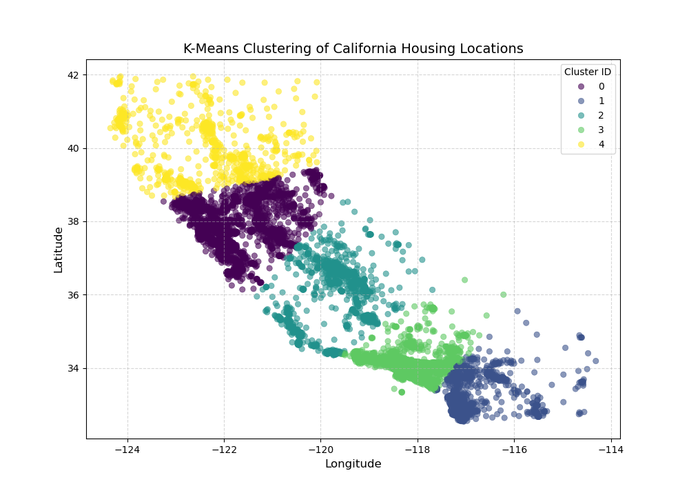

# Task 2: K-Means Clustering & Geographical Plotting

This project uses K-Means clustering to group California housing locations based on latitude and longitude into 5 regional zones.

### Clustering Output Map:

